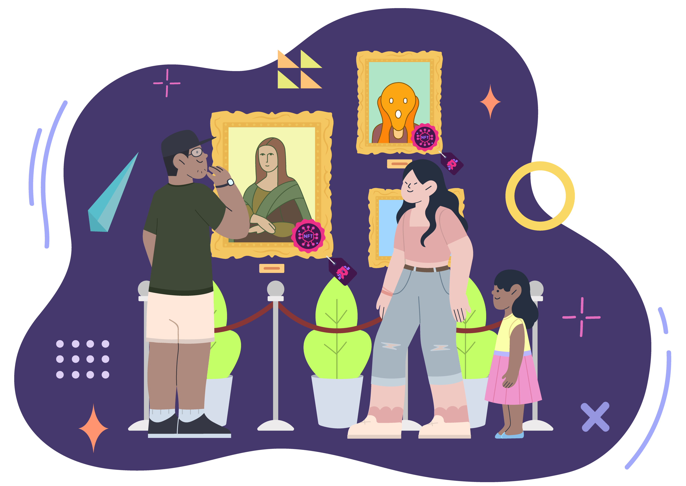

In their current state, museums and galleries have limited use for NFTs. The occasional
[ticket](ticketing.md) or simple digital representation of a real life exhibit are just about all
the options at their disposal, so the lack of adoption by such institutions does not come as a
surprise.

With NFTs 2.0, specifically [multi-resource NFTs](/lego2-multi-resource.md), we finally have
meaningful utility to offer them.

Let's assume we have an exhibit called Mona Lisa. A museum could mint NFTs which simultaneously
contain:

1. The digital version of the painting
2. A short movie about the history of the painting, where it's been and where it came from
3. A multi-language audio-track for the gallery tour around this particular painting
4. A museum-shop voucher for a Mona Lisa high quality poster

These are not separate NFTs - these are all alternative resources of one NFT. The NFT is made into a
rich multi-media experience and is given true utility, versus just being a digital copy of an analog
painting as with NFTs 1.0.

Taking things a step further, another resource could be a random [puzzle piece](/usecases/puzzles), drawn randomly on
purchase from the purchase-block blockhash. This then gives the NFT secondary-market value, along
with earning the museum or gallery royalties, because the experience is gamified - visitors now race
to collect all the puzzle pieces to compose a master puzzle NFT and win an additional prize like,
for example, an exclusive private viewing of an upcoming exhibition.

All this is natively supported by the RMRK standards and available today using an NFT 2.0
marketplace such as [Singular](https://singular.app).
